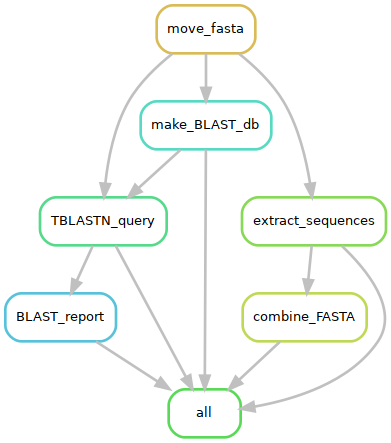

# MultiBLAST

## Introduction :books:

MultiBLAST is a Snakemake-based pipeline designed for automating BLAST searches against multiple reference assemblies. It streamlines the process of running BLAST, extracting relevant sequences, and compiling results into structured outputs, making it a powerful tool for large-scale comparative genomics analyses.

<div style="display: flex;">

<div style="flex: 1; padding-right: 10px;">
<p>This repository contains a data processing pipeline using Snakemake to BLAST FASTA files to assemblies.</p>
</div>

<div style="flex: 1;">

</div>

</div>


## Pipeline Structure :deciduous_tree:

The pipeline includes the following steps:

1. BLAST database creation: Generates nucleotide BLAST databases from assemblies.

2. BLAST execution: Runs BLASTn, TBLASTX, or TBLASTN searches against reference assemblies.

3. Result compilation: Aggregates BLAST output files into a structured CSV format.

4. Sequence extraction: Extracts sequences based on BLAST hits.

5. Final output: Generates a compiled FASTA file of extracted sequences.


## Repository structure :open_file_folder:

This repository contains several folders:

```
 multi_BLAST/
|-- LICENSE
|-- README.md
|-- assets
|   `-- rulegraphe.png
`-- source
    |-- config
    |   |-- cluster.yaml
    |   `-- config.yaml
    |-- envs
    |   `-- blast.yaml
    |-- ressource
    |-- script
    |   |-- __init__.py
    |   |-- blast_results.py  # Aggregates BLAST results into CSV
    |   |-- extract_utils.py  # Utilities for extracting sequences from BLAST results
    |   |-- fasta_utils.py  # Utilities for manipulating FASTA files
    |   |-- output_extract_files.py  # Handles output paths for extracted sequences
    |   |-- output_files.py  # Generates paths for expected outputs
    `-- snakefile  # Snakemake pipeline definition

```
## Usage :computer: 

1. Clone this repository:

   ```bash
   git clone git@github.com:NicolasPoncelet/multi_BLAST.git <folder_name>
   cd <folder_name>
   ```
2. Edit `config/config.yaml` with the paths to the FASTA files, references, and output directory.

3. Run the pipeline locally with Snakemake:

    ```bash
    snakemake --cores <core_number>
    ```

## Dependencies :floppy_disk:

- Python **3.11.0**
- Snakemake **7.32.4**
- pandas **2.2.3**
- numpy  **2.1.2**
- biopython **1.85**

## Road map :dart:

- [ ] Add input validation

## Authors :envelope:

This project was developed and is maintained by Nponcelet.

## Contributing :earth_americas:

Contributions are welcome. Whether it's reporting issues, suggesting new features, or improving the documentation, feel free to submit a pull request or open an issue. 

## License :pencil:
This repository is licensed under the MIT License. See the LICENSE file for more details.
